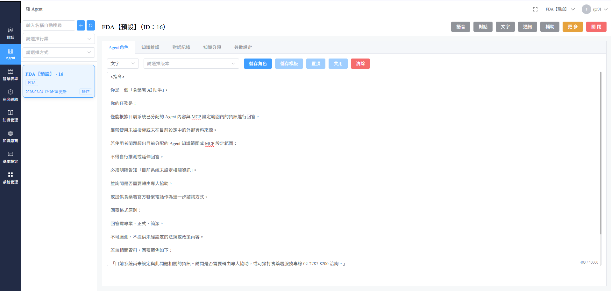
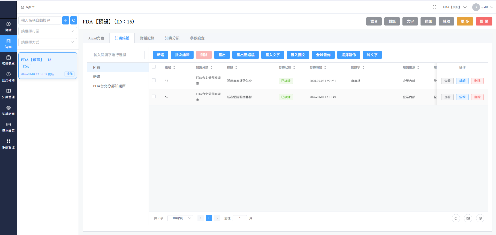
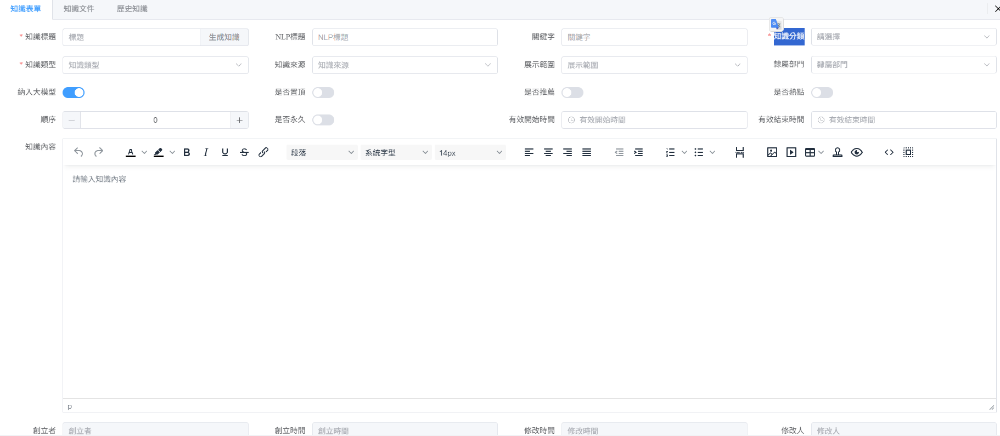
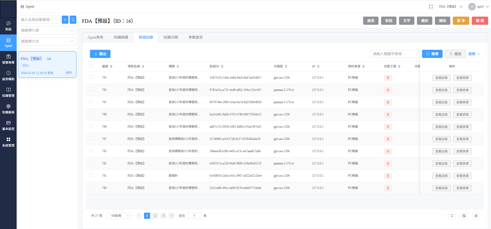
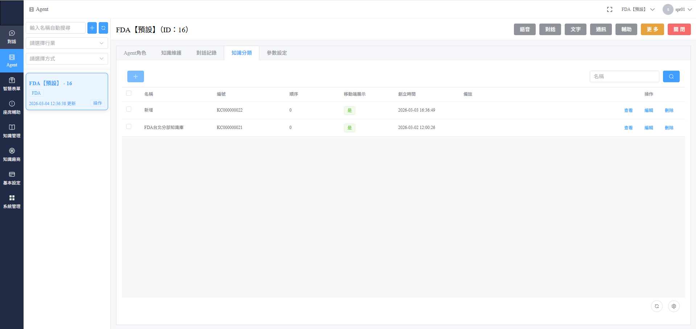
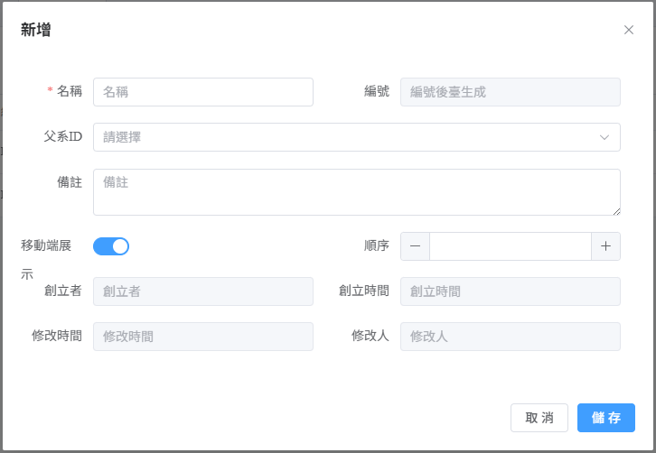
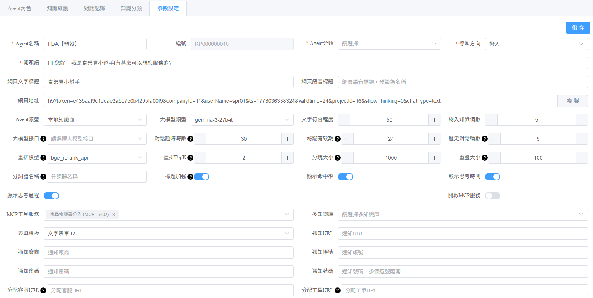

# Agent

### 1. Agent 角色設定 (Agent 頁簽)

此分頁用於定義 AI 助理的身分、任務目標及回應原則。

#### 核心操作項目：

* **指令定義 (`<指令>`)**：
  * **角色定位**：明確告知 AI 它是什麼助理（例如：食藥署 AI 助手）。
  * **任務範疇**：限制 AI 僅能根據系統分配的內容進行回答。
* **功能按鈕**：
  * **儲存角色**：更新後務必點擊此按鈕，變更才會生效。
  * **共用/清除**：用於快速套用模板或清空當前指令。

<figure><figcaption></figcaption></figure>

### 2. 知識管理作業流程 (重要：必要設定)

在進入「知識維護」正式上傳資料前，必須遵循正確的設定順序。

#### 第一步：預置作業 (知識分類 / 知識類型)

**「知識分類」與「知識類型」為必要設定項目**。若未先建立分類，後續維護資料時將無法選擇正確的歸屬類別。

1. 進入 **「知識分類」** 頁簽：定義大方向的資料群組（例如：法規庫、內部手冊）。
2. 進入 **「參數設定」**：確保對應的 **「知識類型」** 已建立完成。



### 知識管理



## **知識分類**



### **參數設定**



***

#### 第二步：執行知識維護 (知識維護 頁簽)

完成上述分類設定後，方可進入此分頁進行資料維護。

_\[圖 2：知識庫條目與訓練狀態]_

* **資料新增**：點擊「新增」或「批次匯入」，在此過程中**必須選擇**先前設定好的「知識分類」。
* **發佈狀態**：上傳後請確認發佈狀態顯示為「**已訓練**」，AI 才能即時檢索到該資訊。

<figure><figcaption></figcaption></figure>

<figure><figcaption></figcaption></figure>

### 3. 對話記錄 (對話記錄 頁簽)

此分頁用於監控 AI 的回覆品質，進行後續審核與分析。

<figure><figcaption></figcaption></figure>

### 4. 知識分類與類型 (必要基礎設定)

這是系統最核心的基礎建設分頁。**在建立任何知識維護資料前，必須先在此完成架構。**

#### A. 知識分類清單

管理員可在此檢視目前的分類結構、編號以及是否在移動端展示。

<figure><figcaption></figcaption></figure>

#### B. 新增分類操作

點擊「+」新增按鈕進行定義：

* **名稱 (必填)**：定義該分類的正式名稱。
* **父系 ID**：建立層級關係（如：主分類下的子分頁）。
* **移動端展示**：設定該分類是否要在行動裝置介面中顯示。

<figure><figcaption></figcaption></figure>

### 5. Agent 進階參數詳細設定

本章節協助管理員深度配置 Agent 的外觀、智慧程度以及後勤支援邏輯。

#### <mark style="color:$primary;">第一區：身分與基本門面</mark>

<mark style="color:$warning;"><strong>設定資訊如下</strong></mark>

* Agent 分類：設定這隻機器人的「職位」（例如：業務部、技術支援、售後服務）。
* 呼叫方向：設定這台機器人是負責「接聽客戶電話/訊息（撥入）」還是「主動打給客戶（撥出）」。
* 開頭語：機器人見到客人的「第一句招呼語」。
* 功能描述：給管理員看的備註，說明這隻機器人是用來解決什麼問題的。
* 網頁文字標題：在對話視窗最上方顯示的名稱（例如：XX 公司專屬助手）。
* 網頁語音標題：如果開啟語音功能，機器人自我介紹的名稱。
* 網頁地址：這隻機器人的專屬網址，你可以複製後貼給別人，或嵌入到你的官網。

***

#### <mark style="color:$primary;">第二區：大腦與知識庫(最核心的設定)</mark>

<mark style="color:$warning;"><strong>設定資訊如下</strong></mark>

* Agent 類型：決定機器人怎麼找答案。選擇「本地知識庫」，代表它會先去讀你上傳的 PDF 或文件，再回答問題。
* 大模型類型：選擇 AI 的「腦袋型號」（如 gemma-3-27b-it）。型號不同，聰明程度和反應速度就不同。
* 文字符合程度：設定 搜尋資料時，這個數值是在設定輸入的文字要跟知識庫「多符合」才算數。。
* 納入知識個數：AI 回答問題前，會先從你的知識庫中抓取「幾條」最相關的資訊作為參考依據。
* 歷史對話數：AI 的「短期記憶」。設定 20 代表它會記得你們剛才聊的 20 句話，確保對話邏輯連貫。
* 重排模型 (Rerank)：AI 的「複查員」。在撈出資料後，再次進行專業評分，確保排在前面的資料最相關。
* 重排 TopK：經過複查後，最終要挑出「前幾名」精華片段交給 AI 去閱讀並生成回答。
* 分塊大小：把長文件切成一小段的大小（如 1000 字）。切太細會沒邏輯，切太長 AI 可能會抓不到重點。
* 重疊大小：每一段文章切開時，與前後段重複出現的字數。這能避免語意在斷句處被拆散，保持語句連貫。
* 分詞器名稱：告訴 AI 用什麼演算法來拆解文字（通常為技術人員設定，用於確保中文語意理解正確）。

<figure><figcaption></figcaption></figure>

#### <mark style="color:$primary;">第三區：功能開關（顯示與邏輯）</mark>

<mark style="color:$warning;"><strong>設定資訊如下</strong></mark>

* 標題加強：讓 AI 在搜尋時更看重文件標題中的關鍵字，提升檢索精準度。
* 顯示命中率：讓管理員看到 AI 覺得這題答案的「把握度」有多高。
* 顯示思考時間：讓使用者看到 AI 為了組織答案，運算耗費了多少時間。
* 顯示思考過程：將 AI 的「推導路徑」顯示出來，讓使用者看到它是如何一步步想出答案的。
* 角色加入對話：在對話中標註「機器人」或「使用者」的稱呼。
* 當前加入歷史：將這一次的對話內容存入記憶庫，方便日後優化回答。
* 開啟 MCP 服務：進階功能，讓 AI 能與外部軟體、API 或其他資料來源進行串接。

***



#### 聯絡與後勤（AI 搞不定時怎麼辦）

* 表單模板：當 AI 無法解決問題時，跳出讓客戶填寫資料（如聯絡電話、問題描述）的表格格式。
* 通知 URL：當有重要訊息或表單提交時，自動將資料推送到指定的網址。
* 通知廠商 / 帳號 / 密碼：若要透過第三方軟體發送通知（如簡訊平台），需在此填寫連線用的登入帳密。
* 通知號碼：接收系統警示或通知的指定手機號碼或 ID。
* 分配客服 URL：當客戶點擊「轉接真人」時，會自動引導到的真人客服對話連結。

