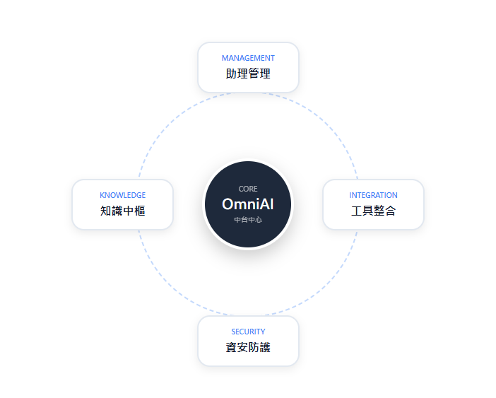

# AI中台功能 AI Services

## AI 中台功能

OmniAI 中台的核心價值在於提供一個「低門檻、高精準、強資安」的開發環境，讓企業能將 AI 實際落地。

#### 1. 核心應用場景



#### AI 助理不只是聊天機器人，而是能深入企業運作的數位員工

* **客服支援**：24/7 自動回應、處理查詢與分派流程。
* **知識管理**：協助員工快速查詢 SOP、公司政策及 FAQ。
* **行銷互動**：提供活動推薦、優惠通知與社群自動回覆。
* **流程自動化**：協助填寫表單、預約登記與引導報名。


#### 2. 控制台管理 (Dashboard)

透過視覺化介面，管理員可即時掌握運作狀態：

* **即時監測**：透過進度環反映系統任務或訓練進度。
* **版本管理**：明確標示系統版本，確保技術資訊同步。
* **自定義介面**：彈性調整監控組件，滿足不同管理需求。

#### 3. 技術優勢 (Technical Advantages)

| 模組名稱            | 功能概述           | 商業價值        |
| --------------- | -------------- | ----------- |
| **No-Code 編輯器** | 無需程式碼即可建立助理。   | 降低門檻，快速部署。  |
| **知識庫關聯**       | 串接企業文件或外部 API。 | 消除幻覺，提升精準度。 |
| **資安防護網**       | 企業級數據隔離與權限管控。  | 確保商業機密不外洩。  |

**\[ 🏃 快速流程 ]** **上傳知識** ➔ **設定參數** ➔ **發佈助理** ➔ **數據監控**

<figure><figcaption></figcaption></figure>
