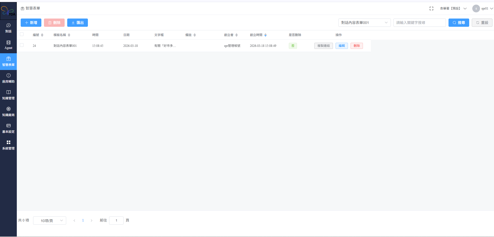

# 智慧表單 Smart Forms

### 模組說明：智慧表單 (Smart Forms)

功能定義： 本模組用於集中存放與管理透過 Agent 對話過程中，根據預設模板自動提取資訊並生成的「套印表單」。使用者可在此檢視所有已生成的表單紀錄、進行編輯、刪除或匯出操作。

#### 1. 介面功能總覽

* 功能路徑： 左側功能選單 > 智慧表單
* 列表欄位：
  * 編號/模板名稱： 顯示表單對應的底層模板（例如：對話內容表單001）。
  * 時間/日期： 系統紀錄該表單生成的確切時間點。
  * 文字框/備註： 顯示對話中擷取的關鍵內容片段或使用者手動註記。
  * 創立者/時間： 紀錄執行 Agent 對話並觸發表單生成的使用者帳號。

<figure><figcaption></figcaption></figure>

#### 2. 標準操作流程

**A. 檢視與檢索表單**

1. 關鍵字搜尋： 於右上方搜尋框輸入「表單內容」或「關鍵字」，點擊 \[搜尋] 快速定位紀錄。
2. 模板過濾： 透過下拉選單選擇特定的「模板名稱」，僅顯示該類別的表單紀錄。
3. 重新整理： 點擊 \[重設] 可清除搜尋條件並還原初始列表。

**B. 表單編輯與異動**

1. 編輯紀錄： 點擊操作欄位中的 \[編輯]，可針對該次生成的表單欄位進行微調或補充備註。
2. 刪除紀錄： 點擊 \[刪除] 可將該筆紀錄從列表中移除。
3. 複製連結： 點擊 \[複製連結] 可取得該表單的專屬 URL，方便分享給團隊成員快速查閱。

**C. 批次操作與匯出**

1. 批次刪除： 勾選列表左側的複選框，點擊上方紅色的 \[刪除] 按鈕。
2. 資料匯出： 點擊 \[匯出] 按鈕，可將目前列表中的表單資料匯出為 Excel 或 CSV 格式，供後續數據分析使用。

***



#### &#x20;注意事項 (Tips)

* 自動生成機制： 智慧表單內的資料僅在 Agent 對話中觸發了「表單套印」指令且成功匹配模板後才會自動產生。
* 權限限制： 僅具備系統管理員或特定專案權限之帳號可執行「批次刪除」操作。

